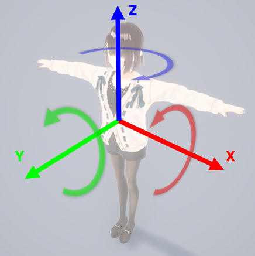
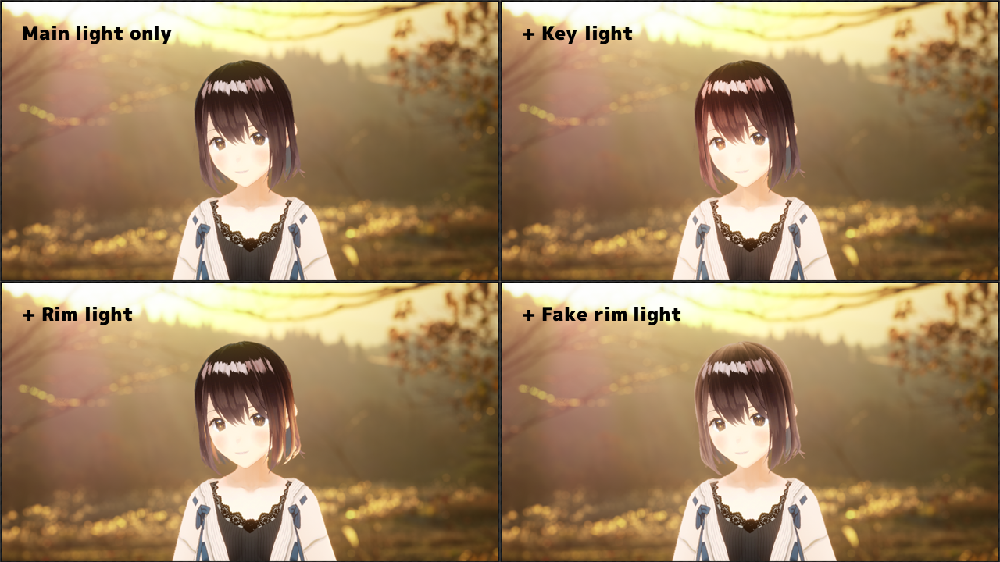

# Lighting settings

Change settings from the `Lighting settings` menu on the left of the screen.

## Main light

Adjusts the orientation of the main light source, which determines the basic position of the self-shadow.

The orientation of each axis is shown in the image below.

{ loading=lazy }

## Key light

A light typically used to illuminate the character's face.  
The direction of the key light is the same as that of the main light.

## Rim light

A light used to illuminate the character's rim.  
The direction of the rim light is automatically determined by the relative position of the camera, the character, and the main light.

## Fake rim light

A function to add a specified color to the edges of the character.  
We refer to this as "Fake" because the internal processing does not simulate a light, but the result is visually similar to a rim light.  
With `attenuation`, you can adjust how far the color extends from the rim.

## Example

{ loading=lazy }
