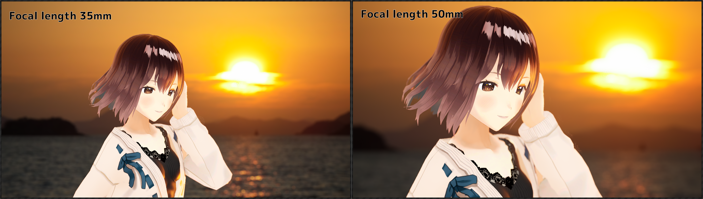
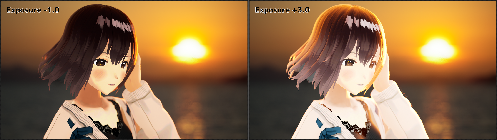
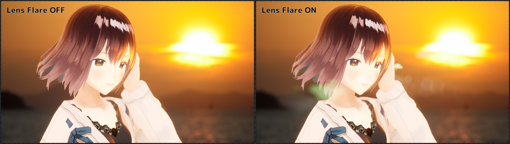
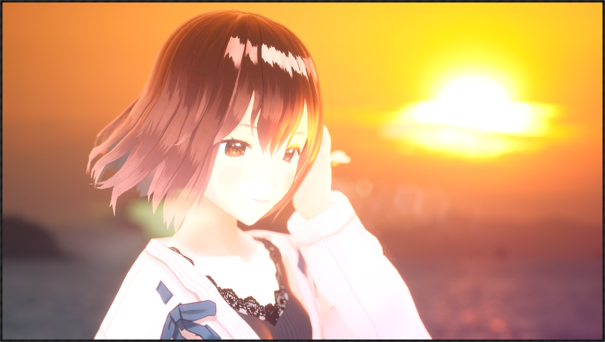
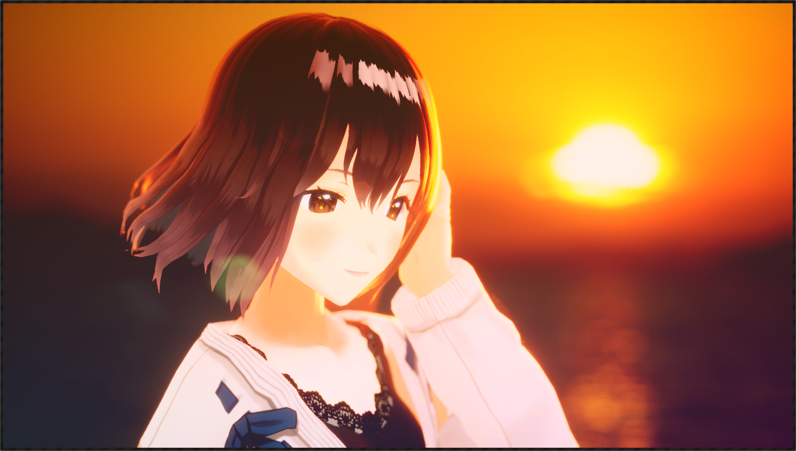

# Post process effect settings

## Depth of Field

The larger the `Aperture` (F value), the wider the range in focus.  
By default, the camera is automatically set to focus on the character's face, but you can also adjust the focus manually by unchecking `Auto` next to `Focus Distance`.

{ loading=lazy }

## Focal Length and FOV

`Focal Length` affects the Field of View (FOV).
FOV is determined with the sensor size of 23.76mm x 13.365mm.

{ loading=lazy }

## Exposure

`Exposure` adjusts the overall brightness.  
By checking `Auto`, you can also simulate a light/dark adaptation that keeps the screen brightness constant.

{ loading=lazy }

## Bloom

In real world, subsurface scattering in the retina of the eye or on camera film causes light to blur around bright areas.  
Bloom processing simulates this by applying a kind of blur to areas on the screen that are brighter than the `threshold` value.  
Although not necessarily physically correct, this effect makes bright areas appear to glow.

{ loading=lazy }

## Lens Flare

Modern camera lenses are usually a composite of multiple glasses.  
To simulate the light scattering on each glass, lens flare applies a kind of image processing based on areas on the screen that are brighter than the `threshold` value.  

{ loading=lazy }

## Gradient Filter

`Gradient Filter` adds a color gradient on the screen by specifying 4 colors and the center coordinates of each on the screen.  
If the image becomes too bright, increase `ND` (attenuation) to balance the image.

<!-- { loading=lazy } -->

## Color Correction

`Color Correction` corrects the image by specifying contrast, saturation, and so on.  
In the image below, the `contrast` and `saturation` are increased, and negative value are specified for `Lift` to darken the image.

<!-- { loading=lazy } -->

