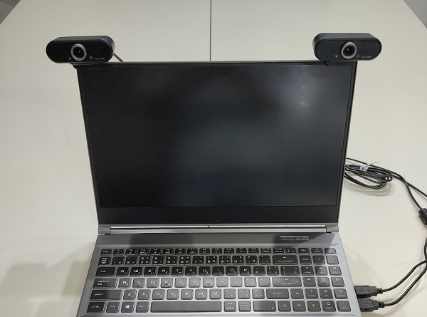

# Webcam settings

## What kind of camera should I use?

The following camera was used in the development of MocapForStreamer. (FOV is around 90 degree.)

[Amazon.co.jp: Webカメラ 1080P, YoulisnフルHD 広角 30fps](https://www.amazon.co.jp/Web%E3%82%AB%E3%83%A1%E3%83%A9-Youlisn%E3%83%95%E3%83%ABHD-%E3%82%A6%E3%82%A7%E3%83%96%E3%82%AB%E3%83%A1%E3%83%A9-zoom%E5%AF%BE%E5%BF%9C-%E3%83%A1%E3%83%BC%E3%82%AB%E3%83%BC%E4%BF%9D%E8%A8%BC/dp/B08CBV2PK9)
    

- The wider the **FOV**, the wider the space for motion capture. However, MocapForStreamer calculates the 3D position with a simple pinhole camera model, so if the image is distorted like a fisheye lens, the movement cannot be captured correctly. A camera with low distortion and a wide FOV is most suitable.
- If the **frame rate** is low, that value can be a bottleneck in the frame rate of the capture. Considering the performance of your PC, get cameras with a higher frame rate than that of your desired capture result. The performance of MocapForStreamer itself is, using RTX3070 for example, about 60fps.  
- HD to FHD **Image size** is recommended. 

## Camera placement

- Place the two cameras side by side, e.g. on a PC display, so that the optical axes of the two cameras are parallel.
- The two cameras should be placed 20-30 cm apart.

{ loading=lazy }

## Open camera 

- In the 'Webcam settings' section of MocapForStreamer, specify the camera on the left side **as seen from the user** as the 'Left camera' and the camera on the right side as the 'Right camera'.
- By default, the camera is controlled using the 'Windows Media Framework', but some cameras do not work. If the camera does not start correctly, specify 'DirectShow' in the 'Webcam framework' and reopen the camera.

## Camera calibration

- Place your face in the center of the field of view of both cameras and press "Calibrate" while looking straight at the camera.
- Place your face in the center of the field of view of both cameras and press "Calibrate" while looking at a 45 degree angle to the camera.

{ loading=lazy }

!!! Tip "To input the values manually"
    - Camera Distance: Measure the distance of two cameras.
    - Focal length: Measure the distance in pixels between the center of the image and a point 45 degree away from the camera's optical axis.