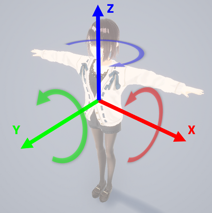
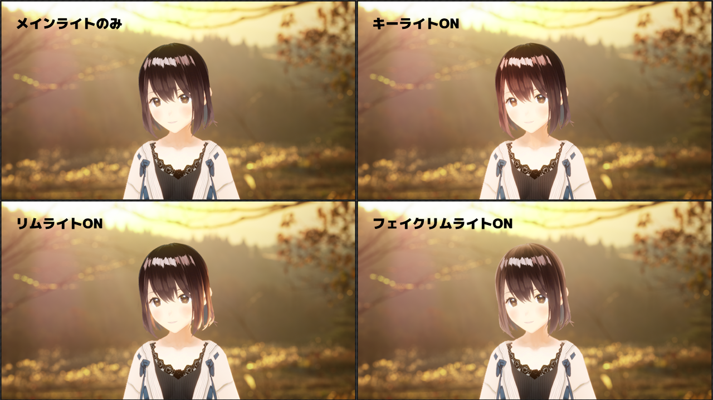

# ライティングの設定

画面左の「Lighting settings」メニューから設定を変更できます。  

## メインライト

主光源の向きを調整できます。基本的な落ち影の位置が決定されます。

各軸の向きは下記の画像の通りです。

{ loading=lazy }

## キーライト

キャラクターの顔などを明るく照らすためのライトです。  
キーライトの向きはメインライトの向きと同じです。

## リムライト

キャラクターの縁を明るく照らすためのライトです。  
リムライトの向きはカメラとキャラクターの相対的な位置関係から自動的に決定されます。

## フェイクリムライト

キャラクターの縁に指定した色を追加する機能です。  
内部の処理的にはライトとしてのシミュレーションを行っていませんが、見た目上はリムライトと同じような結果となるため、「フェイク」と称しています。  
「減衰」で、色が縁からどこまで伸びるかを調整できます。

## 例

{ loading=lazy }
