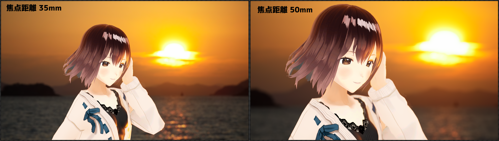
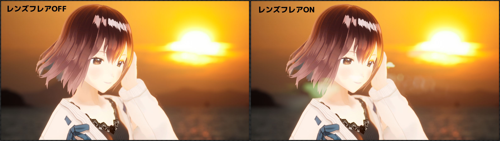
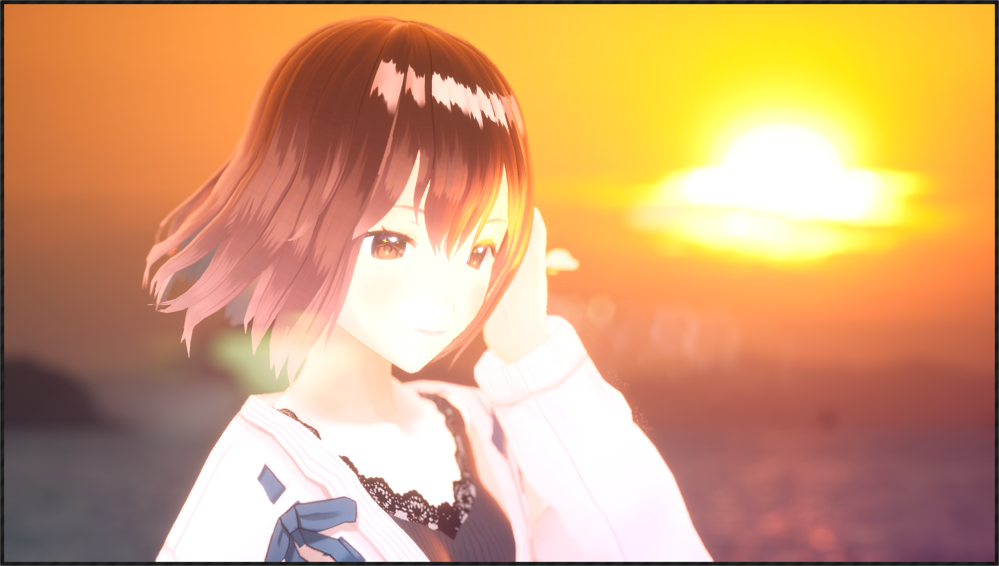
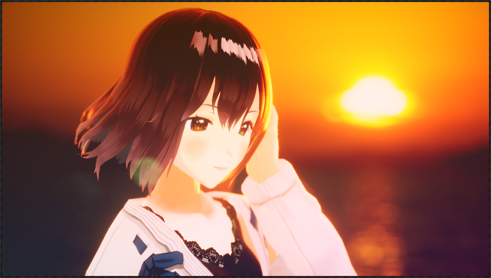

# ポストプロセス効果の設定

## ボケ

「開口サイズ（F値）」が大きいほど、ピントが合う範囲が広くなります。  
デフォルトでは自動的にキャラクターの顔面にピントが合うように設定されていますが、「撮影距離」の「Auto」のチェックを外して手動でピントを調整することもできます。

{ loading=lazy }

## 焦点距離と視野角

「焦点距離」は視野角に影響します。  
なお、センサーサイズが 23.76mm × 13.365mm であるものとして視野角が決定されます。

{ loading=lazy }

## 露光

全体の明るさを調整できます。  
「Auto」をチェックすることで、画面の明るさを一定に保つような明暗順応をシミュレートすることもできます。

{ loading=lazy }

## ブルーム

現実においては、目の網膜やカメラフィルムでのサブサーフェース スキャッタリングにより、明るい部分の周囲に光がにじむような現象が発生します。  
これをシミュレートするものとして、画面上で「閾値」以上に明るい部分に対してある種のぼかしを適用するのがブルーム処理です。  
必ずしも物理的に正しい描画とはなりませんが、明るい部分が発光しているかのような効果をもたらします。  

{ loading=lazy }

## レンズフレア

現実においては、カメラは通常複数のレンズを組み合わせて使用しており、それぞれのレンズで光の散乱が発生します。  
散乱光の映り込みをシミュレートするものとして、画面上で「閾値」以上に明るい部分に基づいてある種の画像処理を適用するのがレンズフレアです。  

{ loading=lazy }

## グラデーションフィルタ

画像に対して、グラデーションを重ねます。  
4つの色と、それぞれの画像中での中心座標を指定します。  
画像が明るくなりすぎてしまう場合は、ND（減光）を増やしてバランスをとってください。
<!-- { loading=lazy } -->

## 色修正

コントラストや彩度などを指定し、画像を修正します。  
下記の画像では、グラデーションフィルタで明るくなりすぎた画像に対して、コントラストと彩度を上げ、さらにLiftに負の値を指定して画像を全体的に黒に寄せてみました。
<!-- { loading=lazy } -->

