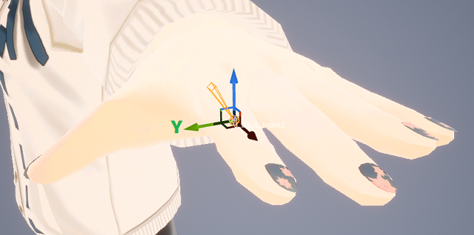

# 動きの設定

画面左の「リグ設定」メニューから、動きをどのようにキャラクターに適用するかを設定します。  

## 上半身のひねり

「上半身のひねりを有効化」をオフにすると、上半身が常に正面を向いた状態になります。

## 腰の位置

「腰の位置を固定」をオンにすると、腰の位置が指定した座標に固定されます。  
現実の体とカメラとの位置関係に合わせて、上記の座標は調整してください。

!!! Warning "肩が変になるときは、「上半身のひねりを有効化」をオフが推奨"
    「上半身のひねりを有効化」と「腰の位置を固定」が両方ともオンのときは、肩のボーンが意図しない方向に向きがちです。  
    その場合は、下記のいずれかをお試しください。

    - 「座標の調整 > 各関節の位置のオフセット > 肩」を調整する
    - 「上半身のひねりを有効化」をオフにする

## 顔のトラッキング位置からHeadボーンへのオフセット

AIは、画像中の人の目・鼻・口の位置から、顔の位置を推定します。  
推定された顔の位置と、キャラクターのHeadボーンの位置との差を、「顔から頭へのオフセット」で指定します。  
現実の首を上下左右に向けながら、キャラクターの首の動きに違和感がなくなるよう調整します。

## ハンドトラッキングの実行方法

ハンドトラッキングをステレオカメラで実行するか、単カメラで実行するかを、「ハンドトラッキングをステレオカメラで実行」で選択します。  

- オン（ステレオカメラで実行）： より繊細な表現が可能ですが、手を振るなどの素早い動作に弱いです。
- オフ（単カメラで実行）： 処理負荷が軽く、また、より頑強なトラッキングが可能です。

## 指の回転の向きの調整

指の回転の向きが正しくない場合は、「指の回転のSecondary axis」で多少の調整が可能です。  
各指の関節が、どの向きを軸として回転するかを指定します。  
例えばデフォルトでは、人差し指はY方向を軸として関節が回転するよう設定されています。  

{ loading=lazy }