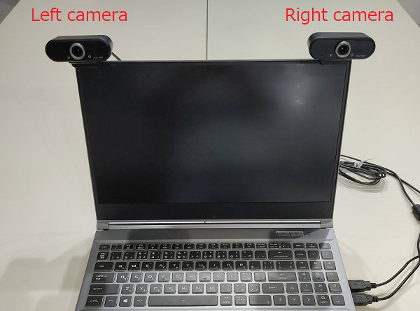

# ウェブカメラの設定

## どんなウェブカメラがいいの？

MocapForStreamerの開発では下記のカメラを使用しました。（視野角はおそらく90度前後です）

[Amazon.co.jp: Webカメラ 1080P, YoulisnフルHD 広角 30fps](https://www.amazon.co.jp/Web%E3%82%AB%E3%83%A1%E3%83%A9-Youlisn%E3%83%95%E3%83%ABHD-%E3%82%A6%E3%82%A7%E3%83%96%E3%82%AB%E3%83%A1%E3%83%A9-zoom%E5%AF%BE%E5%BF%9C-%E3%83%A1%E3%83%BC%E3%82%AB%E3%83%BC%E4%BF%9D%E8%A8%BC/dp/B08CBV2PK9)

- **視野角**は広い方がモーションキャプチャできる空間を広く確保できます。しかし、MocapForStreamerではシンプルなピンホールカメラモデルで三次元位置を計算しているため、魚眼レンズのように画像に歪みが生じると動きを正しくキャプチャできません。歪みが少なく、視野角の大きいカメラが最も適しているといえます。
- **フレームレート**が低い場合、その値がキャプチャ結果のフレームレートのボトルネックとなり得ます。使用するPCの性能を勘案した上で、ご自身が目標とされるキャプチャ結果のフレームレート以上のカメラをご用意ください。なお、MocapForStreamer自体の処理能力は、例えばRTX3070では60fps程度が目安です。  
- **画像サイズ**は、HD～FHDが推奨です。

## カメラ配置

- 2つのカメラをPCのディスプレイの上などに並べ、2つのカメラが平行になるように配置してください。
- 2つのカメラは、20～30cm程度の間隔をあけて配置してください。

{ loading=lazy }

## カメラの起動

- MocapForStreamerの「Webcam settings」で、**ユーザから見て**左側にあるカメラを「Left camera」、右側にあるカメラを「Right camera」として指定します。
- デフォルトでは、「Windows Media Framework」を使ってカメラを制御していますが、一部のカメラは動作しません。カメラが正しく起動しない場合は、「Webcam framework」で「DirectShow」を指定し、カメラを開きなおしてください。

## カメラ校正

- カメラの視野の中央付近に顔が映るようにします。
- カメラをまっすぎ見た状態で、「Camera Distance」の「Calibrate」をクリックします。
- カメラに対して斜め45度を向いた状態で、「Focal length」の「Calibrate」をクリックします。

{ loading=lazy }

!!! Tip "手動で値を入力するには"
    - Camera Distanceは、2つのウェブカメラの間の距離を定規で測って入力することが可能です。  
    - Focal lengthは、カメラの光軸から45度の位置にある点が、カメラ画像中で画像の中心から何ピクセル離れた位置にあるかを測定して入力することが可能です。